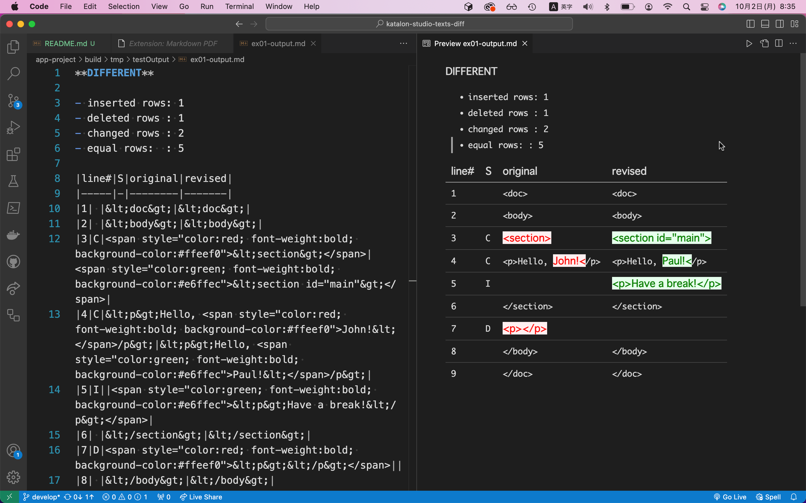

Utilizing java-diff-utils in Katalon Studio
===========================================

1st release date: April, 2021
2nd revision: Oct, 2023

author kazurayam

This project presents a custom Keyword (a helper class) named `com.kazurayam.ks.TextsDiffer` for projects of [Katalon Studio](https://www.katalon.com/).

The class originally developed with Katalon Studio v8.6.6 but is not dependent on the Katalon Studio's version. It should work on even KS v7.0.

## Problem to solve

Web testers often want to compare 2 text files. The files could be in various format: CSV, JSON, XML, etc.

As minimum requirement, they want to know if 2 texts are completely identical or not.

Additionally they want to see the differences, if any, in human-readable format, such as
[Markdown](https://guides.github.com/features/mastering-markdown/).

Testers usually do not require Patching features which many "diff utilities" provide.

I want to perform texts-diff and reporting in Katalon Studio.

## Solution

Utilize [java-diff-utils](https://github.com/java-diff-utils/java-diff-utils/wiki) in Katalon Studio.

## How to run the demo

### Preparing the project

- Download the zip of this project from the [Releases](https://github.com/kazurayam/katalon-studio-texts-diff/releases) page, unzip it.
- The root directory 'katalon-studio-texts-diff' contains 3 sub directories: `app-project`, `docs` and `lib-project`. The `lib-project` contains a Katalon Studio project where I developed the source code of the custom keyword. The `app-project` contains a Katalon Studio project where I applied the custom Keyword to demonstrate how to use it. If you want to use the custom Keyword in your own Katalon project, you want to look at the `app-project`.

### Installing external dependencies into your Katalon project

In the `Drivers` directory of your Katalon project, you NEED to install 2 external jar files.

1. [`java-diff-utils-4.12.jar`](https://mvnrepository.com/artifact/io.github.java-diff-utils/java-diff-utils/4.12)
2. [`katalon-studio-texts-diff-x.x.x.jar`](https://github.com/kazurayam/katalon-studio-texts-diff/releases)

The [`java-diff-utils-x.x.x`](https://github.com/java-diff-utils/java-diff-utils) is an OpenSource library in Java for performing the comparison operations between texts. This enables us to generate diff information.

I developed the [`katalon-studio-texts-diff-x.x.x`] library which wraps the `java-diff-utils-x.x.x` to utilize it in your Katalon Studio project. It can generate a diff report in Markdown format with side-by-side view.

### Running the sample test

You want to start Katalon Studio GUI. You want to open the `app-project` directory. A Katalon project named `TextsDifferApplication` will be launched.

Open the Test Case "`ex01 diff 2 strings and write the report into file`". It looks like this:

```
import java.nio.file.Files
import java.nio.file.Path
import java.nio.file.Paths

/**
 * ex01 diff 2 strings and write the report into file
 */

String text1 = """<doc>
<body>
<section>
<p>Hello, John!</p>
</section>
<p></p>
</body>
</doc>
"""

String text2 = """<doc>
<body>
<section id="main">
<p>Hello, Paul!</p>
<p>Have a break!</p>
</section>
</body>
</doc>
"""

report into a file
String outpath = "build/tmp/testoutput/ex01-output.md"

// take diff of 2 Strings, write the diff
CustomKeywords.'com.kazurayam.ks.TextsDiffer.diffStrings'(text1, text2, outpath)

Path out = Paths.get(outpath)
assert Files.exists(out)
assert out.toFile().length() > 0
```

The script will compare 2 xml files

  - [`doc1.xml`](./app-project/src/test/fixtures/doc1.xml)
  - [`doc2.xml`](./app-project/src/test/fixtures/doc2.xml)


### How to view the output diff report

The script will create a diff report in Markdown format, save it into a file `app-project/build/tmp/testOutput/ex01-output.md`. The output will be formatted in Markdown. The file will like this:

```
**DIFFERENT**

- inserted rows: 1
- deleted rows : 1
- changed rows : 2
- equal rows:  : 5

|line#|S|original|revised|
|-----|-|--------|-------|
|1| |&lt;doc&gt;|&lt;doc&gt;|
|2| |&lt;body&gt;|&lt;body&gt;|
|3|C|<span style="color:red; font-weight:bold; background-color:#ffeef0">&lt;section&gt;</span>|<span style="color:green; font-weight:bold; background-color:#e6ffec">&lt;section id="main"&gt;</span>|
|4|C|&lt;p&gt;Hello, <span style="color:red; font-weight:bold; background-color:#ffeef0">John!&lt;</span>/p&gt;|&lt;p&gt;Hello, <span style="color:green; font-weight:bold; background-color:#e6ffec">Paul!&lt;</span>/p&gt;|
|5|I||<span style="color:green; font-weight:bold; background-color:#e6ffec">&lt;p&gt;Have a break!&lt;/p&gt;</span>|
|6| |&lt;/section&gt;|&lt;/section&gt;|
|7|D|<span style="color:red; font-weight:bold; background-color:#ffeef0">&lt;p&gt;&lt;/p&gt;</span>||
|8| |&lt;/body&gt;|&lt;/body&gt;|
|9| |&lt;/doc&gt;|&lt;/doc&gt;|
```

The raw Markdown text is hard to read in a plain text editor. So you want to view it using some viewer tool for Markdown document. For example, I personally use [Visual Studio Code, Markdown preview](https://code.visualstudio.com/Docs/languages/markdown#_markdown-preview). It can render the diff report in Markdown as follows.



This looks nice, doesn't it?

## More types of input text

The sample Test Case `ex01` uses `com.kazurayam.ks.TextsDiffer.diffString()` method that takes 2 Strings as input. The `TextsDiffer` class implements more methods that can take various types: Files, URLs etc.

See the [`More examples`](./docs/index.md) document for more usecases.

## API

You can have a look at the API documentation of `TextsDiffer` class at

- [API doc](./docs/api/index.html)

## History

This is project was originally created in order to propose a solution to the following post in the Katalon Studio User Forum:

- [How can I compare 2 XML files](https://forum.katalon.com/t/how-can-i-compare-2-xml-files/44854) dated at Oct 2020

In order to answer this question, I created a Test Case

- [lib-project/Test Cases/TC1](lib-project/Scripts/TC1/Script1619137698459.groovy)

and posted it to Kataln User Forum

- https://forum.katalon.com/t/comparing-2-texts-in-katalon-studio/54104

In September 2023, another Katalon user displayed his interested to this

- https://forum.katalon.com/t/verify-complexjsonresponses/97722/13

I reviewed my previous post and found there is a room to improve. I thought I should develop a custom Keyword and distribute it in a jar file, with which anyone can utilize the `java-diff-utils` in Katalon Studio more easily.
