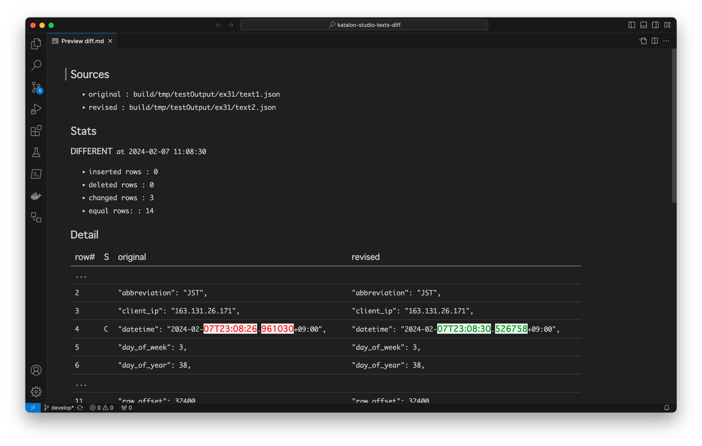

== ex31 chronos diff

In some cases, we want to perform a work procedure as follows. We have a single web application, a single environment, a single host name to test.

1. Download web resources from the web app, save it into a local file
2. Have some intermission (hours, minutes, seconds, ... undetermined)
3. Download web resources form the same web app, save it into another local file
4. Pick up the 2 files, compare them to find any _chronological_ differences between the 2 observations

The following code shows the essence of the work.

[source,groovy]
----
include::../app-project/Scripts/ex31 chronos diff/Script1696149389049.groovy[]
----

This example creates output like this.

- `text1.json`
[source,json]
----
include::./out/ex31/text1.json[]
----

- `text2.json`
[source,json]
----
include::./out/ex31/text2.json[]
----

- `diff.md`
[source,text]
----
include::./out/ex31/diff.md[]
----

The `diff.md` file could be previews as follows:

In this example we can easily find the difference --- the timestamp changed.

