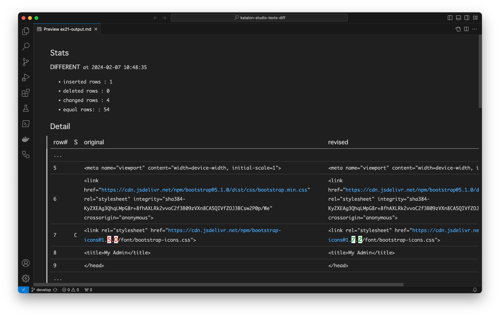

-   [Examples](#examples)
    -   [ex01 diff 2 strings and write the report into file](#ex01-diff-2-strings-and-write-the-report-into-file)
    -   [ex02 diff 2 strings and print the stats to console](#ex02-diff-2-strings-and-print-the-stats-to-console)
    -   [ex03 do the same as ex02 by calling TextsDiff as Plain Old class (not as Keyword)](#ex03-do-the-same-as-ex02-by-calling-textsdiff-as-plain-old-class-not-as-keyword)
    -   [ex11 diff 2 files with relative paths to the current working directory](#ex11-diff-2-files-with-relative-paths-to-the-current-working-directory)
    -   [ex12 diff 2 files with relative paths to the specified base directory](#ex12-diff-2-files-with-relative-paths-to-the-specified-base-directory)
    -   [ex13 diff files with absolute paths](#ex13-diff-files-with-absolute-paths)
    -   [ex21 diff 2 URLs](#ex21-diff-2-urls)
    -   [ex31 chronos diff](#ex31-chronos-diff)
    -   [ex32 twins diff](#ex32-twins-diff)
    -   [ex41 pretty print JSON](#ex41-pretty-print-json)
    -   [ex42 pretty print JSON while ordering Map entities by keys](#ex42-pretty-print-json-while-ordering-map-entities-by-keys)
    -   [ex43 pretty print JSON then diff](#ex43-pretty-print-json-then-diff)

# Examples

-   Date: October, 2023

-   Author: kazurayam

This page shows the examples how to use `com.kazurayam.ks.TextsDiffer` class in Katalon Studio. You can download the jar at the \[`Releases`\](<https://github.com/kazurayam/katalon-studio-texts-diff/releases>) page.

## ex01 diff 2 strings and write the report into file

1.  The following script calls the `diffString(String,String,String)` method of the `com.kazurayam.ks.TestsDiffer` class.

2.  If you would like, you can use it as an **custom Keyword** in the Manual mode of the Test Case editor.

3.  The 1st and 2nd arguments are regarded as input text. The inputs in the sample contain XML texts which are similar but different in detail.

4.  The 3rd argument is regarded as a path of file. The `TextDiffer` writes a diff report into the file.

5.  The output will be in Markdown text format.

<!-- -->

    import java.nio.file.Files
    import java.nio.file.Path
    import java.nio.file.Paths

    /**
     * ex01 diff 2 strings and write the report into file 
     */

    String text1 = """<doc>
    <body>
    <section>
    
Hello, John!

    </section>
    

    </body>
    </doc>
    """

    String text2 = """<doc>
    <body>
    <section id="main">
    
Hello, Paul!

    
Have a break!

    </section>
    </body>
    </doc>
    """

    String outpath = "build/tmp/testoutput/ex01-output.md"

    // take diff of 2 Strings, write the diff report into a file
    CustomKeywords.'com.kazurayam.ks.TextsDiffer.diffStrings'(text1, text2, outpath)

    Path out = Paths.get(outpath)
    assert Files.exists(out)
    assert out.toFile().length() > 0

The diff report generated looks like this:

    **DIFFERENT**

    - inserted rows: 1
    - deleted rows : 1
    - changed rows : 2
    - equal rows:  : 5

    |line#|S|original|revised|
    |-----|-|--------|-------|
    |1| |&lt;doc&gt;|&lt;doc&gt;|
    |2| |&lt;body&gt;|&lt;body&gt;|
    |3|C|&lt;section&gt;|&lt;section id="main"&gt;|
    |4|C|&lt;p&gt;Hello, John!&lt;/p&gt;|&lt;p&gt;Hello, Paul!&lt;/p&gt;|
    |5|I||&lt;p&gt;Have a break!&lt;/p&gt;|
    |6| |&lt;/section&gt;|&lt;/section&gt;|
    |7|D|&lt;p&gt;&lt;/p&gt;||
    |8| |&lt;/body&gt;|&lt;/body&gt;|
    |9| |&lt;/doc&gt;|&lt;/doc&gt;|

It is difficult to read in a plain text editor. You need a tool to view this nicely. If you use [Visual Studio Code, Markdown Preview](https://code.visualstudio.com/Docs/languages/markdown#_markdown-preview), you can see a nice preview, like this:

<figure>

</figure>

## ex02 diff 2 strings and print the stats to console

The following script does

1.  The following script calls `TextsDiffer.diffString(String,String)`.

2.  The 1st and 2nd arguments are regarded as input text. The inputs contain XML texts which are similar but different in detail.

3.  `TextsDiffer.diffString(String,String)` with 2 arguments will return a String value.

4.  The returned String will be a short JSON text, which contains the statistical information of the diff report.

<!-- -->

    import groovy.json.JsonSlurper

    /**
     * ex02 diff 2 strings and print the stats to console
     */

    String text1 = """<doc>
    <body>
    <section>
    
Hello, John!

    </section>
    

    </body>
    </doc>
    """

    String text2 = """<doc>
    <body>
    <section id="main">
    
Hello, Paul!

    
Have a break!

    </section>
    </body>
    </doc>
    """

    // pass 2 arguments of String to receive a String as report
    String json = CustomKeywords.'com.kazurayam.ks.TextsDiffer.diffStrings'(text1, text2)
    println json

    // parse the returned JSON, read the content to make assertions
    JsonSlurper slurper = new JsonSlurper()
    def object = slurper.parseText(json)
    assert object instanceof Map
    assert object.isDifferent == true
    assert object.changedRows == 2

When I run it, this script emits the following JSON in the console.

    {
        "rows": 9,
        "isDifferent": true,
        "insertedRows": 1,
        "deletedRows": 1,
        "changedRows": 2,
        "equalRows": 5
    }

With this JSON, you can quickly see if the 2 input texts are different or not. You can parse the returned JSON string into an instance of `java.util.Map` using `groovy.json.JsonSlurper` and get access to the content. The `ex02` contains sample script how to do it.

## ex03 do the same as ex02 by calling TextsDiff as Plain Old class (not as Keyword)

The `com.kazurayam.ks.TextsDiff` is a plain old Groovy class. You can call it directly.

    import com.kazurayam.ks.TextsDiffer

    /**
     * ex03 call the TextsDiffer class directly, not as a custom Keyword
     */

    String text1 = """<doc>
    <body>
    <section>
    
Hello, John!

    </section>
    

    </body>
    </doc>
    """

    String text2 = """<doc>
    <body>
    <section id="main">
    
Hello, Paul!

    
Have a break!

    </section>
    </body>
    </doc>
    """

    // pass 2 arguments of String to receive a String as report
    TextsDiffer differ = new TextsDiffer()
    String md = differ.diffStrings(text1, text2)
    println md

This script does not use `CustomKeywords.'fully qualified class name.methodName'(args)` syntax. This script does the same processing as the `ex02`.

## ex11 diff 2 files with relative paths to the current working directory

Let me assume there are 2 files:

-   `src/test/fixtures/doc1.xml`

<!-- -->

    <doc>
    <body>
    <section>
    
Hello, John!

    </section>
    

    </body>
    </doc>

-   `` src/test/fixtures/doc2.xml` ``

<!-- -->

    <doc>
    <body>
    <section id="main">
    
Hello, Paul!

    
Have a break!

    </section>
    </body>
    </doc>

You can write a Test Case script which compares the 2 files and writes a diff report into a file.

    /**
     * ex11 diff 2 files with relative paths to the current working directory
     */

    CustomKeywords.'com.kazurayam.ks.TextsDiffer.diffFiles'(
        "src/test/fixtures/doc1.xml",
        "src/test/fixtures/doc2.xml",
        "build/tmp/testOutput/ex11-output.md")

In this example, the path is written as a relative path. The `TextsDiffer` interpretes the relative paths are relative to the current working directory.

The `ex11` code is rather fragile as it depends on the current working directory (**CWD** for short). When you run a Test Case in Katalon Studio GUI, the **CWD** will be always equal to the project’s root directory. However when you run a Test Case in Katalon Runtime Engine in the OS command line environment, the **CWD** is variable. The **CWD** depends how you write the shell script that calls the `katalonc` command. Therefore the `ex11` script would run fine in Katalon Studio, but it may fail in Katalon Runtime Engine due to FileNotFoundException.

## ex12 diff 2 files with relative paths to the specified base directory

You can specify the base directory with which the relative paths are resolved. Let’s have a look at an example:

    import com.kms.katalon.core.configuration.RunConfiguration

    /**
     *  ex12 diff 2 files with relative paths to the specified base directory
     */

    CustomKeywords.'com.kazurayam.ks.TextsDiffer.diffFiles'(
        RunConfiguration.getProjectDir(),     /* base directory */
        "src/test/fixtures/doc1.xml",
        "src/test/fixtures/doc2.xml",
        "build/tmp/testOutput/ex12-output.md")

This example calls `TextsDiffer.diffFiles(String, String, String String)` method. The 1st argument is expected to be an absolute path of a directory. When the 2nd, 3rd and 4th arguments are relative path, then these will be resolved to absolute paths taking the 1st directory path as the base.

With this method signature, you can specify input files and output file located outside the current working directory.

You can also specify an absolute path to the 2nd, 3rd and 4th argument. These absolute path will be respected regardless whatever value is given to the 1st argument.

## ex13 diff files with absolute paths

You can specify absolute paths as the input files and the output file. Let’s have a look at an example:

    import com.kms.katalon.core.configuration.RunConfiguration

    /**
     *  ex13 diff 2 files with absolute paths
     */

    CustomKeywords.'com.kazurayam.ks.TextsDiffer.diffFiles'(
        "${System.getProperty('user.home')}/tmp/doc1.xml",
        "${System.getProperty('user.home')}/tmp/doc2.xml",
        "${RunConfiguration.getProjectDir()}/build/tmp/testOutput/ex13-output.md")

The expression `System.getProperty('user.home')` will return the absolute path of "home directory" of my OS user. For example, `'/Users/kazurayam'`.

The expression `RunConfiguration.getProject()` will return a string like `/Users/kazurayam/tmp/myKatalonProject` which is the absolute path of the project’s root directory.

## ex21 diff 2 URLs

`com.kazurayam.ks.TextsDiffer.diffURLs(String,String)` method can download 2 texts from the specified URL and take diff of them. Let me show you an example.

    /**
     * ex21 diff 2 URLs
     */

    CustomKeywords.'com.kazurayam.ks.TextsDiffer.diffURLs'(
        "http://myadmin.kazurayam.com/",    /* input as original */
        "http://devadmin.kazurayam.com/",   /* input as revised  */
        "build/tmp/testOutput/ex21-output.md"           /* output */
        )

You can have a look at the target URLs:

-   <http://myadmin.kazurayam.com/>

-   <http://devadmin.kazurayam.com/>

These 2 pages look similar, but is different in detail.

The script will emit the following output.

    - original: `http://myadmin.kazurayam.com/`
    - revised : `http://devadmin.kazurayam.com/`

    **DIFFERENT**

    - inserted rows: 1
    - deleted rows : 0
    - changed rows : 4
    - equal rows:  : 54

    |line#|S|original|revised|
    |-----|-|--------|-------|
    |1| |&lt;!doctype html&gt;|&lt;!doctype html&gt;|
    |2| |&lt;html lang="ja"&gt;|&lt;html lang="ja"&gt;|
    |3| |  &lt;head&gt;|  &lt;head&gt;|
    |4| |    &lt;meta charset="utf-8"&gt;|    &lt;meta charset="utf-8"&gt;|
    |5| |    &lt;meta name="viewport" content="width=device-width, initial-scale=1"&gt;|    &lt;meta name="viewport" content="width=device-width, initial-scale=1"&gt;|
    |6| |    &lt;link href="https://cdn.jsdelivr.net/npm/bootstrap@5.1.0/dist/css/bootstrap.min.css" rel="stylesheet" integrity="sha384-KyZXEAg3QhqLMpG8r+8fhAXLRk2vvoC2f3B09zVXn8CA5QIVfZOJ3BCsw2P0p/We" crossorigin="anonymous"&gt;|    &lt;link href="https://cdn.jsdelivr.net/npm/bootstrap@5.1.0/dist/css/bootstrap.min.css" rel="stylesheet" integrity="sha384-KyZXEAg3QhqLMpG8r+8fhAXLRk2vvoC2f3B09zVXn8CA5QIVfZOJ3BCsw2P0p/We" crossorigin="anonymous"&gt;|
    |7|C|    &lt;link rel="stylesheet" href="https://cdn.jsdelivr.net/npm/bootstrap-icons@1.5.0/font/bootstrap-icons.css"&gt;|    &lt;link rel="stylesheet" href="https://cdn.jsdelivr.net/npm/bootstrap-icons@1.7.2/font/bootstrap-icons.css"&gt;|
    |8| |    &lt;title&gt;My Admin&lt;/title&gt;|    &lt;title&gt;My Admin&lt;/title&gt;|
    |9| |  &lt;/head&gt;|  &lt;/head&gt;|
    |10| |  &lt;body&gt;|  &lt;body&gt;|
    |11| |    &lt;header&gt;|    &lt;header&gt;|
    |12| |      &lt;nav class="navbar navbar-expand-md navbar-dark bg-primary"&gt;|      &lt;nav class="navbar navbar-expand-md navbar-dark bg-primary"&gt;|
    |13| |        &lt;div class="container-fluid"&gt;|        &lt;div class="container-fluid"&gt;|
    |14| |          &lt;a class="navbar-brand" href="#"&gt;My Admin&lt;/a&gt; &lt;button class="navbar-toggler" type="button" data-bs-toggle="collapse" data-bs-target="#navbarNav" aria-controls="navbarNav" aria-expanded="false" aria-label="Toggle navigation"&gt; &lt;span class="navbar-toggler-icon"&gt;&lt;/span&gt; &lt;/button&gt;|          &lt;a class="navbar-brand" href="#"&gt;My Admin&lt;/a&gt; &lt;button class="navbar-toggler" type="button" data-bs-toggle="collapse" data-bs-target="#navbarNav" aria-controls="navbarNav" aria-expanded="false" aria-label="Toggle navigation"&gt; &lt;span class="navbar-toggler-icon"&gt;&lt;/span&gt; &lt;/button&gt;|
    |15| |          &lt;div class="collapse navbar-collapse" id="navbarNav"&gt;|          &lt;div class="collapse navbar-collapse" id="navbarNav"&gt;|
    |16| |            &lt;ul class="navbar-nav"&gt;|            &lt;ul class="navbar-nav"&gt;|
    |17| |              &lt;li class="nav-item"&gt;&lt;a class="nav-link active" aria-current="page" href="#"&gt;Home&lt;/a&gt;&lt;/li&gt;|              &lt;li class="nav-item"&gt;&lt;a class="nav-link active" aria-current="page" href="#"&gt;Home&lt;/a&gt;&lt;/li&gt;|
    |18| |              &lt;li class="nav-item"&gt;&lt;a class="nav-link" href="#"&gt;News&lt;/a&gt;&lt;/li&gt;|              &lt;li class="nav-item"&gt;&lt;a class="nav-link" href="#"&gt;News&lt;/a&gt;&lt;/li&gt;|
    |19| |            &lt;/ul&gt;|            &lt;/ul&gt;|
    |20| |          &lt;/div&gt;|          &lt;/div&gt;|
    |21| |        &lt;/div&gt;|        &lt;/div&gt;|
    |22| |      &lt;/nav&gt;|      &lt;/nav&gt;|
    |23| |    &lt;/header&gt;|    &lt;/header&gt;|
    |24| |    &lt;div class="container mt-5"&gt;|    &lt;div class="container mt-5"&gt;|
    |25| |      &lt;section class="row"&gt;|      &lt;section class="row"&gt;|
    |26| |        &lt;section id="menu" class="col-md-4 mb-5"&gt;|        &lt;section id="menu" class="col-md-4 mb-5"&gt;|
    |27|C|          &lt;div class="list-group"&gt;&lt;a href="./index.html" class="list-group-item list-group-item-action active" aria-current="true"&gt;Profile&lt;/a&gt; &lt;a href="./repositories.html" class="list-group-item list-group-item-action"&gt;Repositories&lt;/a&gt; &lt;a href="./proverbs.html" class="list-group-item list-group-item-action"&gt;Proverbs&lt;/a&gt;|          &lt;div class="list-group"&gt;&lt;a href="./repositories.html" class="list-group-item list-group-item-action"&gt;Repositories&lt;/a&gt; &lt;a href="./proverbs.html" class="list-group-item list-group-item-action"&gt;Proverbs&lt;/a&gt; &lt;a href="./index.html" class="list-group-item list-group-item-action active" aria-current="true"&gt;Profile&lt;/a&gt;|
    |28| |          &lt;/div&gt;|          &lt;/div&gt;|
    |29| |        &lt;/section&gt;|        &lt;/section&gt;|
    |30| |        &lt;section id="profile" class="col-md-8 text-center"&gt;|        &lt;section id="profile" class="col-md-8 text-center"&gt;|
    |31| |          &lt;header class="border-bottom pb-2 mb-3 d-flex align-items-center"&gt;|          &lt;header class="border-bottom pb-2 mb-3 d-flex align-items-center"&gt;|
    |32| |            &lt;h1 class="fs-5 m-0"&gt;My Profile&lt;/h1&gt; &lt;button type="button" class="btn btn-primary ms-auto"&gt; &lt;i class="bi bi-envelope-fill me-1"&gt;&lt;/i&gt; &lt;/button&gt;|            &lt;h1 class="fs-5 m-0"&gt;My Profile&lt;/h1&gt; &lt;button type="button" class="btn btn-primary ms-auto"&gt; &lt;i class="bi bi-envelope-fill me-1"&gt;&lt;/i&gt; &lt;/button&gt;|
    |33| |          &lt;/header&gt;|          &lt;/header&gt;|
    |34|C|          &lt;p&gt;&lt;img src="umineko-1960x1960.jpg" alt="umineko" class="rounded-circle img-fluid ps-5 pe-5"&gt;&lt;/p&gt; &lt;!-- &lt;h2&gt;&lt;span id="clock"&gt;&lt;/span&gt; UTC&lt;/h2&gt; --&gt;|          &lt;p&gt;&lt;img src="umineko-1960x1960.jpg" alt="umineko" class="rounded-circle img-fluid ps-5 pe-5"&gt;&lt;/p&gt;|
    |35|I||          &lt;h2&gt;&lt;span id="clock"&gt;&lt;/span&gt; UTC&lt;/h2&gt;|
    |36| |        &lt;/section&gt;|        &lt;/section&gt;|
    |37| |      &lt;/section&gt;|      &lt;/section&gt;|
    |38| |    &lt;/div&gt;|    &lt;/div&gt;|
    |39| |    &lt;footer class="bg-secondary text-center text-light p-5 mt-5"&gt;|    &lt;footer class="bg-secondary text-center text-light p-5 mt-5"&gt;|
    |40| |      (c) kazurayam.com|      (c) kazurayam.com|
    |41| |    &lt;/footer&gt;|    &lt;/footer&gt;|
    |42| |    &lt;script src="https://cdn.jsdelivr.net/npm/bootstrap@5.1.0/dist/js/bootstrap.bundle.min.js" integrity="sha384-U1DAWAznBHeqEIlVSCgzq+c9gqGAJn5c/t99JyeKa9xxaYpSvHU5awsuZVVFIhvj" crossorigin="anonymous"&gt;|    &lt;script src="https://cdn.jsdelivr.net/npm/bootstrap@5.1.0/dist/js/bootstrap.bundle.min.js" integrity="sha384-U1DAWAznBHeqEIlVSCgzq+c9gqGAJn5c/t99JyeKa9xxaYpSvHU5awsuZVVFIhvj" crossorigin="anonymous"&gt;|
    |43| |&lt;/script&gt;|&lt;/script&gt;|
    |44|C|    &lt;script src="https://cdnjs.cloudflare.com/ajax/libs/jquery/1.11.3/jquery.js"&gt;&lt;/script&gt;|    &lt;script src="https://cdnjs.cloudflare.com/ajax/libs/jquery/1.12.4/jquery.js"&gt;&lt;/script&gt;|
    |45| |    &lt;script&gt;|    &lt;script&gt;|
    |46| |    /**|    /**|
    |47| |     * display the current timestamp in the format of "07:22:13"|     * display the current timestamp in the format of "07:22:13"|
    |48| |     */|     */|
    |49| |    $(document).ready(function() {|    $(document).ready(function() {|
    |50| |        var m = new Date();|        var m = new Date();|
    |51| |        var dateString = m.getUTCFullYear() +"/"+ (m.getUTCMonth()+1) +"/"+|        var dateString = m.getUTCFullYear() +"/"+ (m.getUTCMonth()+1) +"/"+|
    |52| |            m.getUTCDate() + " " + m.getUTCHours() + ":" +|            m.getUTCDate() + " " + m.getUTCHours() + ":" +|
    |53| |            m.getUTCMinutes() + ":" + m.getUTCSeconds();|            m.getUTCMinutes() + ":" + m.getUTCSeconds();|
    |54| |        console.log(dateString)|        console.log(dateString)|
    |55| |        $('#clock').text(dateString);|        $('#clock').text(dateString);|
    |56| |    })|    })|
    |57| |&lt;/script&gt;|&lt;/script&gt;|
    |58| |  &lt;/body&gt;|  &lt;/body&gt;|
    |59| |&lt;/html&gt;|&lt;/html&gt;|

I could preview this long Markdown text in VSCode Markdown, as follows:

This diff tells me that the HTML of both URLs uses the same file `bootstrap-icons.css` but the versions are different. `http://myadmin.kazurayam.com` links to the version 1.5.0 while `http://devadmin.kazurayam.com` links to the version 1.7.2. Such difference is hardly visible on the page view on browser.

Sometimes we, developers of web application, want to compare 2 environments of a single web application. These 2 environments would have 2 different host names. For example, the Production environment and the Development. The 2 environment will produce similar web pages which could be slightly different in detail; and we are seriously interested in the details. In such case, the method `TextsDiff.diffURLs()` could be useful.

## ex31 chronos diff

In some cases, we want to perform a work procedure as follows. We have a single web application, a single environment, a single host name to test. So we would do the following work procedure:

1.  Download web resources from the web app, save it into a local file

2.  Have some intermission (hours, minutes, seconds, …​ undetermined)

3.  Download web resources form the same web app, save it into another local file

4.  Pick up the 2 files, compare them to find any *chronological* differences between the 2 observations

The following code shows the essence of the work.

    import java.nio.channels.Channels
    import java.nio.channels.FileChannel
    import java.nio.channels.ReadableByteChannel
    import java.nio.file.Files
    import java.nio.file.Path
    import java.nio.file.Paths

    import com.kazurayam.ks.TextsDiffer
    import com.kms.katalon.core.configuration.RunConfiguration

    import groovy.json.JsonOutput

    /**
     * ex31 chronos diff
     * 
     * download JSON from a URL into file, do it twice, then diff
     */

    def downloadURL(URL url, File output) {
        FileOutputStream fos = new FileOutputStream(output)
        FileChannel fch = fos.getChannel()
        ReadableByteChannel rbch = Channels.newChannel(url.openStream())
        fch.transferFrom(rbch, 0, Long.MAX_VALUE);
    }

    def prettyPrintJson(Path json) {
        String t = JsonOutput.prettyPrint(json.toFile().text)
        json.toFile().text = t  
    }

    // Thanks to https://worldtimeapi.org/pages/examples
    URL url = new URL("http://worldtimeapi.org/api/ip")

    Path projectDir = Paths.get(RunConfiguration.getProjectDir())
    Files.createDirectories(projectDir.resolve("build/tmp/testOutput/ex31"))
    Path text1 = Paths.get("build/tmp/testOutput/ex31/text1.json")
    Path text2 = Paths.get("build/tmp/testOutput/ex31/text2.json")

    // 1st download a JSON from the URL 
    downloadURL(url, text1.toFile())
    prettyPrintJson(text1)

    // Intermission
    Thread.sleep(3000)

    // 2nd download a JSON from the same URL
    downloadURL(url, text2.toFile())
    prettyPrintJson(text2)

    // then diff the 2 texts
    TextsDiffer differ = new TextsDiffer()
    Path out = projectDir.resolve("build/tmp/testOutput/ex31/diff.md")

    differ.diffFiles(text1, text2, out)

This example creates output like this.

-   `text1.json`

<!-- -->

    {
        "abbreviation": "JST",
        "client_ip": "163.131.26.171",
        "datetime": "2023-10-01T22:15:18.742317+09:00",
        "day_of_week": 0,
        "day_of_year": 274,
        "dst": false,
        "dst_from": null,
        "dst_offset": 0,
        "dst_until": null,
        "raw_offset": 32400,
        "timezone": "Asia/Tokyo",
        "unixtime": 1696166118,
        "utc_datetime": "2023-10-01T13:15:18.742317+00:00",
        "utc_offset": "+09:00",
        "week_number": 39
    }

-   `text2.json`

<!-- -->

    {
        "abbreviation": "JST",
        "client_ip": "163.131.26.171",
        "datetime": "2023-10-01T22:15:22.058915+09:00",
        "day_of_week": 0,
        "day_of_year": 274,
        "dst": false,
        "dst_from": null,
        "dst_offset": 0,
        "dst_until": null,
        "raw_offset": 32400,
        "timezone": "Asia/Tokyo",
        "unixtime": 1696166122,
        "utc_datetime": "2023-10-01T13:15:22.058915+00:00",
        "utc_offset": "+09:00",
        "week_number": 39
    }

-   `diff.md`

<!-- -->

    - original: `build/tmp/testOutput/ex31/text1.json`
    - revised : `build/tmp/testOutput/ex31/text2.json`

    **DIFFERENT**

    - inserted rows: 0
    - deleted rows : 0
    - changed rows : 3
    - equal rows:  : 14

    |line#|S|original|revised|
    |-----|-|--------|-------|
    |1| |{|{|
    |2| |    "abbreviation": "JST",|    "abbreviation": "JST",|
    |3| |    "client_ip": "163.131.26.171",|    "client_ip": "163.131.26.171",|
    |4|C|    "datetime": "2023-10-01T22:15:18.742317+09:00",|    "datetime": "2023-10-01T22:15:22.058915+09:00",|
    |5| |    "day_of_week": 0,|    "day_of_week": 0,|
    |6| |    "day_of_year": 274,|    "day_of_year": 274,|
    |7| |    "dst": false,|    "dst": false,|
    |8| |    "dst_from": null,|    "dst_from": null,|
    |9| |    "dst_offset": 0,|    "dst_offset": 0,|
    |10| |    "dst_until": null,|    "dst_until": null,|
    |11| |    "raw_offset": 32400,|    "raw_offset": 32400,|
    |12| |    "timezone": "Asia/Tokyo",|    "timezone": "Asia/Tokyo",|
    |13|C|    "unixtime": 1696166118,|    "unixtime": 1696166122,|
    |14|C|    "utc_datetime": "2023-10-01T13:15:18.742317+00:00",|    "utc_datetime": "2023-10-01T13:15:22.058915+00:00",|
    |15| |    "utc_offset": "+09:00",|    "utc_offset": "+09:00",|
    |16| |    "week_number": 39|    "week_number": 39|
    |17| |}|}|

The `diff.md` file could be previewed as follows:

In this example we can easily find the difference --- the timestamp changed.

## ex32 twins diff

In some cases, we want to compare 2 environments of a single web application --- say, the Production environment and the Development. The host name of the 2 environment’s URL are different, but the 2 environments have almost identical software and database but not completely the same. We are interested in the minute differences of the two. So we would do the following work procedure:

1.  Download web resource from the environment P, save it into a local file

2.  Download web resource from the environment D, save it into a local file

3.  Pick up the 2 files, compare them to find any differences between the twins.

The following code shows the essence of the work.

    import java.nio.channels.Channels
    import java.nio.channels.FileChannel
    import java.nio.channels.ReadableByteChannel
    import java.nio.file.Files
    import java.nio.file.Path
    import java.nio.file.Paths

    import com.kazurayam.ks.TextsDiffer
    import com.kms.katalon.core.configuration.RunConfiguration

    /**
     * ex32 twins diff 
     * 
     * download HTML from a pair of URLs of similar looking, then diff
     */

    def downloadURL(URL url, File output) {
        FileOutputStream fos = new FileOutputStream(output)
        FileChannel fch = fos.getChannel()
        ReadableByteChannel rbch = Channels.newChannel(url.openStream())
        fch.transferFrom(rbch, 0, Long.MAX_VALUE);
    }

    URL url1 = new URL("http://myadmin.kazurayam.com/")
    URL url2 = new URL("http://devadmin.kazurayam.com/")

    Path projectDir = Paths.get(RunConfiguration.getProjectDir())
    Files.createDirectories(projectDir.resolve("build/tmp/testOutput/ex32"))
    Path text1 = Paths.get("build/tmp/testOutput/ex32/text1.html")
    Path text2 = Paths.get("build/tmp/testOutput/ex32/text2.html")

    // 1st download a JSON from the URL
    downloadURL(url1, text1.toFile())

    // 2nd download a JSON from the same URL
    downloadURL(url2, text2.toFile())

    // then diff the 2 texts
    TextsDiffer differ = new TextsDiffer()
    Path out = projectDir.resolve("build/tmp/testOutput/ex32/diff.md")

    differ.diffFiles(text1, text2, out)

This example script shows a simple function `download URL(URL, File)` that downloads any amount of bytes from a given URL and save it into a local file. This should work for any types of web resources --- HTML, JSON, XML, PDF, images, videos, etc.

This example creates output like this:

-   `text1.html`

<!-- -->

    <!doctype html>
    <html lang="ja">
      <head>
        <meta charset="utf-8">
        <meta name="viewport" content="width=device-width, initial-scale=1">
        <link href="https://cdn.jsdelivr.net/npm/bootstrap@5.1.0/dist/css/bootstrap.min.css" rel="stylesheet" integrity="sha384-KyZXEAg3QhqLMpG8r+8fhAXLRk2vvoC2f3B09zVXn8CA5QIVfZOJ3BCsw2P0p/We" crossorigin="anonymous">
        <link rel="stylesheet" href="https://cdn.jsdelivr.net/npm/bootstrap-icons@1.5.0/font/bootstrap-icons.css">
        <title>My Admin</title>
      </head>
      <body>
        <header>
          <nav class="navbar navbar-expand-md navbar-dark bg-primary">
            

              <a class="navbar-brand" href="#">My Admin</a> <button class="navbar-toggler" type="button" data-bs-toggle="collapse" data-bs-target="#navbarNav" aria-controls="navbarNav" aria-expanded="false" aria-label="Toggle navigation">  </button>
              

                <ul class="navbar-nav">
                  <li class="nav-item"><a class="nav-link active" aria-current="page" href="#">Home</a></li>
                  <li class="nav-item"><a class="nav-link" href="#">News</a></li>
                </ul>
              

            

          </nav>
        </header>
        

          <section class="row">
            <section id="menu" class="col-md-4 mb-5">
              
<a href="./index.html" class="list-group-item list-group-item-action active" aria-current="true">Profile</a> <a href="./repositories.html" class="list-group-item list-group-item-action">Repositories</a> <a href="./proverbs.html" class="list-group-item list-group-item-action">Proverbs</a>
              

            </section>
            <section id="profile" class="col-md-8 text-center">
              <header class="border-bottom pb-2 mb-3 d-flex align-items-center">
                <h1 class="fs-5 m-0">My Profile</h1> <button type="button" class="btn btn-primary ms-auto"> <i class="bi bi-envelope-fill me-1"></i> </button>
              </header>
              

 <!-- <h2> UTC</h2> -->
            </section>
          </section>
        

        <footer class="bg-secondary text-center text-light p-5 mt-5">
          (c) kazurayam.com
        </footer>
        
        
        
      </body>
    </html>

-   `text2.html`

<!-- -->

    <!doctype html>
    <html lang="ja">
      <head>
        <meta charset="utf-8">
        <meta name="viewport" content="width=device-width, initial-scale=1">
        <link href="https://cdn.jsdelivr.net/npm/bootstrap@5.1.0/dist/css/bootstrap.min.css" rel="stylesheet" integrity="sha384-KyZXEAg3QhqLMpG8r+8fhAXLRk2vvoC2f3B09zVXn8CA5QIVfZOJ3BCsw2P0p/We" crossorigin="anonymous">
        <link rel="stylesheet" href="https://cdn.jsdelivr.net/npm/bootstrap-icons@1.7.2/font/bootstrap-icons.css">
        <title>My Admin</title>
      </head>
      <body>
        <header>
          <nav class="navbar navbar-expand-md navbar-dark bg-primary">
            

              <a class="navbar-brand" href="#">My Admin</a> <button class="navbar-toggler" type="button" data-bs-toggle="collapse" data-bs-target="#navbarNav" aria-controls="navbarNav" aria-expanded="false" aria-label="Toggle navigation">  </button>
              

                <ul class="navbar-nav">
                  <li class="nav-item"><a class="nav-link active" aria-current="page" href="#">Home</a></li>
                  <li class="nav-item"><a class="nav-link" href="#">News</a></li>
                </ul>
              

            

          </nav>
        </header>
        

          <section class="row">
            <section id="menu" class="col-md-4 mb-5">
              
<a href="./repositories.html" class="list-group-item list-group-item-action">Repositories</a> <a href="./proverbs.html" class="list-group-item list-group-item-action">Proverbs</a> <a href="./index.html" class="list-group-item list-group-item-action active" aria-current="true">Profile</a>
              

            </section>
            <section id="profile" class="col-md-8 text-center">
              <header class="border-bottom pb-2 mb-3 d-flex align-items-center">
                <h1 class="fs-5 m-0">My Profile</h1> <button type="button" class="btn btn-primary ms-auto"> <i class="bi bi-envelope-fill me-1"></i> </button>
              </header>
              

              <h2> UTC</h2>
            </section>
          </section>
        

        <footer class="bg-secondary text-center text-light p-5 mt-5">
          (c) kazurayam.com
        </footer>
        
        
        
      </body>
    </html>

-   `diff.md`

<!-- -->

    - original: `build/tmp/testOutput/ex32/text1.html`
    - revised : `build/tmp/testOutput/ex32/text2.html`

    **DIFFERENT**

    - inserted rows: 1
    - deleted rows : 0
    - changed rows : 4
    - equal rows:  : 54

    |line#|S|original|revised|
    |-----|-|--------|-------|
    |1| |&lt;!doctype html&gt;|&lt;!doctype html&gt;|
    |2| |&lt;html lang="ja"&gt;|&lt;html lang="ja"&gt;|
    |3| |  &lt;head&gt;|  &lt;head&gt;|
    |4| |    &lt;meta charset="utf-8"&gt;|    &lt;meta charset="utf-8"&gt;|
    |5| |    &lt;meta name="viewport" content="width=device-width, initial-scale=1"&gt;|    &lt;meta name="viewport" content="width=device-width, initial-scale=1"&gt;|
    |6| |    &lt;link href="https://cdn.jsdelivr.net/npm/bootstrap@5.1.0/dist/css/bootstrap.min.css" rel="stylesheet" integrity="sha384-KyZXEAg3QhqLMpG8r+8fhAXLRk2vvoC2f3B09zVXn8CA5QIVfZOJ3BCsw2P0p/We" crossorigin="anonymous"&gt;|    &lt;link href="https://cdn.jsdelivr.net/npm/bootstrap@5.1.0/dist/css/bootstrap.min.css" rel="stylesheet" integrity="sha384-KyZXEAg3QhqLMpG8r+8fhAXLRk2vvoC2f3B09zVXn8CA5QIVfZOJ3BCsw2P0p/We" crossorigin="anonymous"&gt;|
    |7|C|    &lt;link rel="stylesheet" href="https://cdn.jsdelivr.net/npm/bootstrap-icons@1.5.0/font/bootstrap-icons.css"&gt;|    &lt;link rel="stylesheet" href="https://cdn.jsdelivr.net/npm/bootstrap-icons@1.7.2/font/bootstrap-icons.css"&gt;|
    |8| |    &lt;title&gt;My Admin&lt;/title&gt;|    &lt;title&gt;My Admin&lt;/title&gt;|
    |9| |  &lt;/head&gt;|  &lt;/head&gt;|
    |10| |  &lt;body&gt;|  &lt;body&gt;|
    |11| |    &lt;header&gt;|    &lt;header&gt;|
    |12| |      &lt;nav class="navbar navbar-expand-md navbar-dark bg-primary"&gt;|      &lt;nav class="navbar navbar-expand-md navbar-dark bg-primary"&gt;|
    |13| |        &lt;div class="container-fluid"&gt;|        &lt;div class="container-fluid"&gt;|
    |14| |          &lt;a class="navbar-brand" href="#"&gt;My Admin&lt;/a&gt; &lt;button class="navbar-toggler" type="button" data-bs-toggle="collapse" data-bs-target="#navbarNav" aria-controls="navbarNav" aria-expanded="false" aria-label="Toggle navigation"&gt; &lt;span class="navbar-toggler-icon"&gt;&lt;/span&gt; &lt;/button&gt;|          &lt;a class="navbar-brand" href="#"&gt;My Admin&lt;/a&gt; &lt;button class="navbar-toggler" type="button" data-bs-toggle="collapse" data-bs-target="#navbarNav" aria-controls="navbarNav" aria-expanded="false" aria-label="Toggle navigation"&gt; &lt;span class="navbar-toggler-icon"&gt;&lt;/span&gt; &lt;/button&gt;|
    |15| |          &lt;div class="collapse navbar-collapse" id="navbarNav"&gt;|          &lt;div class="collapse navbar-collapse" id="navbarNav"&gt;|
    |16| |            &lt;ul class="navbar-nav"&gt;|            &lt;ul class="navbar-nav"&gt;|
    |17| |              &lt;li class="nav-item"&gt;&lt;a class="nav-link active" aria-current="page" href="#"&gt;Home&lt;/a&gt;&lt;/li&gt;|              &lt;li class="nav-item"&gt;&lt;a class="nav-link active" aria-current="page" href="#"&gt;Home&lt;/a&gt;&lt;/li&gt;|
    |18| |              &lt;li class="nav-item"&gt;&lt;a class="nav-link" href="#"&gt;News&lt;/a&gt;&lt;/li&gt;|              &lt;li class="nav-item"&gt;&lt;a class="nav-link" href="#"&gt;News&lt;/a&gt;&lt;/li&gt;|
    |19| |            &lt;/ul&gt;|            &lt;/ul&gt;|
    |20| |          &lt;/div&gt;|          &lt;/div&gt;|
    |21| |        &lt;/div&gt;|        &lt;/div&gt;|
    |22| |      &lt;/nav&gt;|      &lt;/nav&gt;|
    |23| |    &lt;/header&gt;|    &lt;/header&gt;|
    |24| |    &lt;div class="container mt-5"&gt;|    &lt;div class="container mt-5"&gt;|
    |25| |      &lt;section class="row"&gt;|      &lt;section class="row"&gt;|
    |26| |        &lt;section id="menu" class="col-md-4 mb-5"&gt;|        &lt;section id="menu" class="col-md-4 mb-5"&gt;|
    |27|C|          &lt;div class="list-group"&gt;&lt;a href="./index.html" class="list-group-item list-group-item-action active" aria-current="true"&gt;Profile&lt;/a&gt; &lt;a href="./repositories.html" class="list-group-item list-group-item-action"&gt;Repositories&lt;/a&gt; &lt;a href="./proverbs.html" class="list-group-item list-group-item-action"&gt;Proverbs&lt;/a&gt;|          &lt;div class="list-group"&gt;&lt;a href="./repositories.html" class="list-group-item list-group-item-action"&gt;Repositories&lt;/a&gt; &lt;a href="./proverbs.html" class="list-group-item list-group-item-action"&gt;Proverbs&lt;/a&gt; &lt;a href="./index.html" class="list-group-item list-group-item-action active" aria-current="true"&gt;Profile&lt;/a&gt;|
    |28| |          &lt;/div&gt;|          &lt;/div&gt;|
    |29| |        &lt;/section&gt;|        &lt;/section&gt;|
    |30| |        &lt;section id="profile" class="col-md-8 text-center"&gt;|        &lt;section id="profile" class="col-md-8 text-center"&gt;|
    |31| |          &lt;header class="border-bottom pb-2 mb-3 d-flex align-items-center"&gt;|          &lt;header class="border-bottom pb-2 mb-3 d-flex align-items-center"&gt;|
    |32| |            &lt;h1 class="fs-5 m-0"&gt;My Profile&lt;/h1&gt; &lt;button type="button" class="btn btn-primary ms-auto"&gt; &lt;i class="bi bi-envelope-fill me-1"&gt;&lt;/i&gt; &lt;/button&gt;|            &lt;h1 class="fs-5 m-0"&gt;My Profile&lt;/h1&gt; &lt;button type="button" class="btn btn-primary ms-auto"&gt; &lt;i class="bi bi-envelope-fill me-1"&gt;&lt;/i&gt; &lt;/button&gt;|
    |33| |          &lt;/header&gt;|          &lt;/header&gt;|
    |34|C|          &lt;p&gt;&lt;img src="umineko-1960x1960.jpg" alt="umineko" class="rounded-circle img-fluid ps-5 pe-5"&gt;&lt;/p&gt; &lt;!-- &lt;h2&gt;&lt;span id="clock"&gt;&lt;/span&gt; UTC&lt;/h2&gt; --&gt;|          &lt;p&gt;&lt;img src="umineko-1960x1960.jpg" alt="umineko" class="rounded-circle img-fluid ps-5 pe-5"&gt;&lt;/p&gt;|
    |35|I||          &lt;h2&gt;&lt;span id="clock"&gt;&lt;/span&gt; UTC&lt;/h2&gt;|
    |36| |        &lt;/section&gt;|        &lt;/section&gt;|
    |37| |      &lt;/section&gt;|      &lt;/section&gt;|
    |38| |    &lt;/div&gt;|    &lt;/div&gt;|
    |39| |    &lt;footer class="bg-secondary text-center text-light p-5 mt-5"&gt;|    &lt;footer class="bg-secondary text-center text-light p-5 mt-5"&gt;|
    |40| |      (c) kazurayam.com|      (c) kazurayam.com|
    |41| |    &lt;/footer&gt;|    &lt;/footer&gt;|
    |42| |    &lt;script src="https://cdn.jsdelivr.net/npm/bootstrap@5.1.0/dist/js/bootstrap.bundle.min.js" integrity="sha384-U1DAWAznBHeqEIlVSCgzq+c9gqGAJn5c/t99JyeKa9xxaYpSvHU5awsuZVVFIhvj" crossorigin="anonymous"&gt;|    &lt;script src="https://cdn.jsdelivr.net/npm/bootstrap@5.1.0/dist/js/bootstrap.bundle.min.js" integrity="sha384-U1DAWAznBHeqEIlVSCgzq+c9gqGAJn5c/t99JyeKa9xxaYpSvHU5awsuZVVFIhvj" crossorigin="anonymous"&gt;|
    |43| |&lt;/script&gt;|&lt;/script&gt;|
    |44|C|    &lt;script src="https://cdnjs.cloudflare.com/ajax/libs/jquery/1.11.3/jquery.js"&gt;&lt;/script&gt;|    &lt;script src="https://cdnjs.cloudflare.com/ajax/libs/jquery/1.12.4/jquery.js"&gt;&lt;/script&gt;|
    |45| |    &lt;script&gt;|    &lt;script&gt;|
    |46| |    /**|    /**|
    |47| |     * display the current timestamp in the format of "07:22:13"|     * display the current timestamp in the format of "07:22:13"|
    |48| |     */|     */|
    |49| |    $(document).ready(function() {|    $(document).ready(function() {|
    |50| |        var m = new Date();|        var m = new Date();|
    |51| |        var dateString = m.getUTCFullYear() +"/"+ (m.getUTCMonth()+1) +"/"+|        var dateString = m.getUTCFullYear() +"/"+ (m.getUTCMonth()+1) +"/"+|
    |52| |            m.getUTCDate() + " " + m.getUTCHours() + ":" +|            m.getUTCDate() + " " + m.getUTCHours() + ":" +|
    |53| |            m.getUTCMinutes() + ":" + m.getUTCSeconds();|            m.getUTCMinutes() + ":" + m.getUTCSeconds();|
    |54| |        console.log(dateString)|        console.log(dateString)|
    |55| |        $('#clock').text(dateString);|        $('#clock').text(dateString);|
    |56| |    })|    })|
    |57| |&lt;/script&gt;|&lt;/script&gt;|
    |58| |  &lt;/body&gt;|  &lt;/body&gt;|
    |59| |&lt;/html&gt;|&lt;/html&gt;|

The `diff.md` file could be previewed as follows:

The result is just the same as the ex21 case.

## ex41 pretty print JSON

A JSON text can be formatted in two ways --- Compact form and Pretty-printed form.

Compact JSON example:

    { "abbreviation" : "JST", "client_ip" : "163.131.26.17", "datetime" : "2023-10-01T22:15:18.742317+09:00", "day_of_week" : 0, "day_of_year" : 274, "dst" : { "dst" : false, "dst_from" : null, "dst_offset" : 0, "dst_until" : null }, "raw_offset" : 32400, "timezone" : "Asia/Tokyo", "unixtime" : 1696166118, "utc_datetime" : "2023-10-01T13:15:18.742317+00:00", "utc_offset" : "+09:00", "week_number" : 39 }

Pretty-printed JSON example:

    {
        "day_of_week": 0,
        "datetime": "2023-10-01T22:15:18.742317+09:00",
        "client_ip": "163.131.26.17",
        "timezone": "Asia/Tokyo",
        "unixtime": 1696166118,
        "day_of_year": 274,
        "raw_offset": 32400,
        "abbreviation": "JST",
        "dst": {
            "dst_until": null,
            "dst_offset": 0,
            "dst": false,
            "dst_from": null
        },
        "utc_datetime": "2023-10-01T13:15:18.742317+00:00",
        "utc_offset": "+09:00",
        "week_number": 39
    }

These 2 JSON instances are semantically identical. Semantically no different at all.
Many of public URLs that respond JSON will use the Compact form.
However, when I apply the "Texts Diff" tool to JSON, I want to convert
a compact JSON into a pretty-printed JSON before taking diff.
I believe I do not need to explain why.

The following Test Case script shows how to do pretty printing.

    import groovy.json.JsonOutput

    String original = """
    { "abbreviation" : "JST", "client_ip" : "163.131.26.17", "datetime" : "2023-10-01T22:15:18.742317+09:00", "day_of_week" : 0, "day_of_year" : 274, "dst" : { "dst" : false, "dst_from" : null, "dst_offset" : 0, "dst_until" : null }, "raw_offset" : 32400, "timezone" : "Asia/Tokyo", "unixtime" : 1696166118, "utc_datetime" : "2023-10-01T13:15:18.742317+00:00", "utc_offset" : "+09:00", "week_number" : 39 }
    """

    String pretty = JsonOutput.prettyPrint(original)
    print pretty

    File out = new File("./build/tmp/testOutput/ex41-output.json")
    out.text = pretty

## ex42 pretty print JSON while ordering Map entities by keys

The following 2 JSON instances are semantically identical.

Disordered JSON instance:

    {
        "week_number": 39,
        "day_of_week": 0,
        "utc_datetime": "2023-10-01T13:15:18.742317+00:00",
        "datetime": "2023-10-01T22:15:18.742317+09:00",
        "client_ip": "163.131.26.17",
        "timezone": "Asia/Tokyo",
        "unixtime": 1696166118,
        "day_of_year": 274,
        "raw_offset": 32400,
        "dst" : {
            "dst_until": null,
            "dst_offset": 0,
            "dst_until": null,
            "dst": false,
            "dst_from": null
        },
        "utc_offset": "+09:00",
        "abbreviation": "JST"
    }

Ordered JSON instance:

    {
      "abbreviation" : "JST",
      "client_ip" : "163.131.26.17",
      "datetime" : "2023-10-01T22:15:18.742317+09:00",
      "day_of_week" : 0,
      "day_of_year" : 274,
      "dst" : {
        "dst" : false,
        "dst_from" : null,
        "dst_offset" : 0,
        "dst_until" : null
      },
      "raw_offset" : 32400,
      "timezone" : "Asia/Tokyo",
      "unixtime" : 1696166118,
      "utc_datetime" : "2023-10-01T13:15:18.742317+00:00",
      "utc_offset" : "+09:00",
      "week_number" : 39
    }

Please note that the `"key":"value"` pairs in the latter JSON instance
are ordered by keys alphabetically.
When I apply the "Texts Diff" tool to JSON, I want to convert a disordered JSON
into a ordered JSON before taking diff.
The following Test Case script shows how to do it.

    import com.kazurayam.ks.JsonPrettyPrinter

    // ex42 pretty print JSON while ordering Map entries by keys

    // disorderd JSON
    String originalText = """{
        "week_number": 39,
        "day_of_week": 0,
        "utc_datetime": "2023-10-01T13:15:18.742317+00:00",
        "datetime": "2023-10-01T22:15:18.742317+09:00",
        "client_ip": "163.131.26.17",
        "timezone": "Asia/Tokyo",
        "unixtime": 1696166118,
        "day_of_year": 274,
        "raw_offset": 32400,
        "dst" : {
            "dst_until": null,
            "dst_offset": 0,
            "dst_until": null,
            "dst": false,
            "dst_from": null
        },
        "utc_offset": "+09:00",
        "abbreviation": "JST"
    }
    """

    File out = new File("./build/tmp/testOutput/ex42-output.json")

    // pretty print JSON
    JsonPrettyPrinter jpp = new JsonPrettyPrinter()
    String ordered = jpp.orderMapEntriesByKeys(originalText)

    out.text = ordered
    print ordered

Here I used the `orderMapEntitiesByKeys()` method of
[`com.kazurayam.ks.JsonPrettyPrinter`](https://github.com/kazurayam/katalon-studio-texts-diff/blob/develop/lib-project/Keywords/com/kazurayam/ks/JsonPrettyPrinter.groovy) class. It utilizes [Jackson ObjectMapper](https://www.baeldung.com/jackson-object-mapper-tutorial) class.

## ex43 pretty print JSON then diff

Let me assume I have 2 JSON instances:

FileA:

    {
      "key1":"data1",
      "key2":"data2"
    }

FileB:

    {
      "key2":"data2",
      "key1":"data1"
    }

These 2 JSON instances are semantically identical.

If I apply take textual diff of the FileA and FileB, I will get the following diff report.

This diff report is arguable. This report tells me that there are textual differences. However, if I do not like to be disturbed by the differences which are semantically insignificant, the above report is too noisy.

Now I would apply the methodology "ex42 pretty print JSON while ordering Map entities by keys". I would convert the 2 input JSON and then take the diff.
The following report shows the result.

The following Test Case creates these 2 diff reports.

    import com.kazurayam.ks.TextsDiffer
    import com.kazurayam.ks.JsonPrettyPrinter

    // ex43 pretty print JSON then diff

    String textA = """{
        "key1": "value1",
        "key2": "value2"
    }
    """
    File fileA = new File("build/tmp/testOutput/ex43-fileA.json")
    fileA.text = textA

    String textB = """{
        "key2": "value2",
        "key1": "value1"
    }
    """
    File fileB = new File("build/tmp/testOutput/ex43-fileB.json")
    fileB.text = textB

    // compare 2 JSON files as is
    TextsDiffer differ = new TextsDiffer()
    differ.diffFiles(fileA, fileB, new File("build/tmp/testOutput/ex43-output1.md"))

    // convert 2 JSON texts (order Map entries by keys)
    String ppA = JsonPrettyPrinter.orderMapEntriesByKeys(textA)
    String ppB = JsonPrettyPrinter.orderMapEntriesByKeys(textB)

    // compare 2 converted JSON texts
    differ.diffStrings(ppA, ppB, "build/tmp/testOutput/ex43-output2.md")

In the latter diff report, both JSON are converted by the `com.kazurayam.ks.JsonPrettyPrinter` class to have the same order of keys. So the report clearly shows that FileA and FileB are similar.

Which diff report do you like? --- You can choose either. `com.kazurayam.ks.TestsDiffer` and `com.kazurayam.ks.JsonPrettyPrinter` are provided. You can use them and produce both report.
